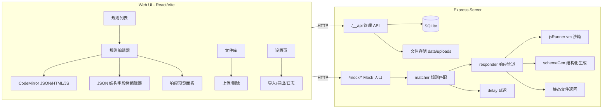

## 产品概述

一个本地可运行的 Mock Server（工程名 Mocker），提供可视化 Web 管理台：用户无需写代码即可增删改查 Mock 接口，为每个接口配置 HTTP 方法、路径参数、响应延迟、状态码、响应头，并选择 4 种静态/动态响应方式与 1 种「JSON 结构化」模式。Mock 服务与管理后台共用同一端口。

## 核心功能

1. **接口规则管理**
   - 左侧规则列表（按方法徽标着色、支持关键字/方法筛选、启用开关、复制/删除），右侧编辑区，支持新增、编辑、删除、复制规则
   - 每条规则包含：名称、HTTP 方法（GET/POST/PUT/PATCH/DELETE/HEAD/OPTIONS）、路径（支持 `:id` 路径参数，同一路径不同方法独立配置）、状态码、自定义响应头、启用状态
2. **延迟设置**
   - 固定延迟毫秒数 + 可选随机抖动区间（0~N ms），实际延迟 = 固定值 + 随机抖动；预览/试运行时跳过延迟
3. **响应类型**
   - JSON：代码编辑器内编写并实时校验
   - HTML：直接返回 HTML 文本
   - File：上传文件，按扩展名推断 Content-Type 返回（支持二进制）
   - JavaScript：编辑器内写脚本，入参 `req`（method/path/params/query/headers/body），`return` 即响应体，服务端 `vm` 沙箱执行并允许 `require` 内置白名单库（faker 等）
   - JSON 结构化模式：可视化字段树增删嵌套字段，字段可选类型 string / number / int / boolean / uuid / date / enum / object / array；string 可填正则表达式实时生成符合规则的随机值（如手机号 `^1[3-9]\d{9}$`、订单号）；array 可设元素数量范围
4. **预览与调试**
   - 每个编辑器提供「生成预览」按钮，直接在 UI 中看到最终响应体、状态码、响应头（结构化模式展示随机生成样例）
5. **辅助能力**
   - 文件库管理（上传/删除/引用）、配置导入导出 JSON、运行信息与最近请求日志

## 技术栈选型

- **运行时**：Node.js v26.8.1（本机已确认）、npm 11
- **后端**：Express 5 + TypeScript，`tsx` 开发热重载
- **持久化**：SQLite。优先使用 Node 内置 `node:sqlite`（`DatabaseSync`，零原生依赖、免编译），若运行时不可用则自动回退到 `better-sqlite3`（列为 optionalDependency）。两者 `prepare/run/get/all/exec` 接口一致，用一层薄适配器统一
- **前端**：React 18 + Vite 5 + TypeScript + Tailwind CSS v4（`@tailwindcss/vite`）+ shadcn 风格本地 UI 原语（Radix 无头组件 + cva）
- **代码编辑器**：CodeMirror 6（`@uiw/react-codemirror` + lang-json / lang-javascript / lang-html）
- **数据生成**：`randexp`（正则 → 随机字符串）、`@faker-js/faker`（JS 沙箱与字段预设）、`uuid`
- **其他**：`path-to-regexp`（Express 5 同版 v8，路径参数匹配）、`cors`（mock 路由需跨域）、`multer`（文件上传）、`lucide-react`、`clsx/tailwind-merge`

## 实现方案

**整体策略**：单仓库单 package.json，前端 Vite 构建产物 `dist/web` 由 Express 同一进程托管，`/__api/*` 为管理 API，`/mock/*` 为 Mock 入口（前缀可通过环境变量配置），其余路径回退到 SPA。

**关键技术决策**

1. **Mock 匹配方式**：不动态注册 Express 路由（避免路由表膨胀与热更新复杂度），而是在 `app.use(MOCK_PREFIX, handler)` 中按 `method + path` 匹配规则表。规则表带版本号缓存，写操作（增删改）自增版本号使缓存失效；`pathToRegexp` 预编译结果按 `${method} ${path}` 缓存，命中 O(1)，未编译回退 O(n) 遍历，规则量级（数百条）下无性能问题。
2. **JS 沙箱**：`vm.runInNewContext` + `timeout: 2000`，上下文注入 `req / console / faker / RandExp / require(白名单)`。明确在 README 中声明 vm 不是安全边界（本地可信使用），不做多进程隔离以避免复杂度。
3. **正则生成**：`randexp` 设置重复上限并 try/catch 兜底，防止灾难性正则卡死；生成失败时降级为普通随机串并在 UI 提示。
4. **结构化模式生成**：递归遍历字段树，`array` 按 min/max 随机数量、`object` 递归子节点、`string` 按 regex / faker 模板 / 常量 / 枚举四种来源生成。
5. **预览复用**：预览接口与真实 mock 共用同一 `responder` 管道，仅 `skipDelay=true` 并返回 `{status, headers, contentType, body, durationMs}` 元信息，保证「所见即所得」。

## 架构设计



**数据流**：请求 `GET /mock/api/users/:id` → `matcher` 命中规则 → `delay` 等待 → `responder` 按 `responseType` 生成 body（静态文本 / 文件上传流 / vm 执行结果 / schemaGen 随机数据）→ 写状态码 + 响应头 + Content-Type → 记录请求日志（内存环形缓冲 100 条）。

## 实现要点（执行细节）

- **DB 适配**：`server/src/db/index.ts` 动态 `await import('node:sqlite')`，失败则 `import('better-sqlite3')`；统一暴露 `run/get/all/exec`；`lastInsertRowid` 用 `Number()` 归一（node:sqlite 可能返回 bigint）。建表使用 `CREATE TABLE IF NOT EXISTS`，启动时执行一次。
- **路径与路由冲突**：管理 API 固定 `/__api` 前缀，Mock 前缀默认 `/mock`（`MOCK_PREFIX` 环境变量可改，支持置空表示根路径，置空时需确保管理路由先注册）。
- **CORS**：仅对 Mock 路由启用 `cors()` 并自动应答 OPTIONS 预检，管理 API 不开启（仅本地访问）。
- **延迟**：`await sleep(delayMs + random(0, jitter))`；`delayMs` 上限做校验（如 ≤ 60000）。
- **响应头**：过滤空 key，自动推断 Content-Type（json → `application/json; charset=utf-8`，html → `text/html`，js 按返回值类型推断，file → mime 查找），用户显式配置优先。
- **文件响应**：使用 `res.sendFile` 绝对路径，限制上传目录在 `data/uploads` 内，防止路径穿越。
- **日志**：mock 命中与 JS 执行异常使用统一 `logger`；异常统一返回 500 + 结构化错误信息，不回显脚本源码细节之外的敏感内容（本地工具，允许回显错误栈便于调试）。
- **前端状态**：规则列表与当前编辑规则用 React 局部状态 + `api.ts` 封装 fetch；编辑器采用受控 + 失焦保存/显式保存按钮，避免频繁写库。
- **开发体验**：`npm run dev` 用 `concurrently` 并行启动 `tsx watch server/src/index.ts`（端口 3001）与 `vite`（5173，代理 `/__api`、`/mock` 到 3001）；`npm run build && npm start` 生产单端口运行。

## 目录结构

```
Mocker/
├── package.json                   # [NEW] 单包管理前后端依赖与 scripts(dev/build/start)
├── tsconfig.json                  # [NEW] 基础 TS 配置（paths、strict）
├── tsconfig.server.json           # [NEW] 服务端配置（module: nodenext, outDir）
├── tsconfig.web.json              # [NEW] 前端配置（jsx: react-jsx, DOM lib）
├── vite.config.ts                 # [NEW] root=web, outDir=../dist/web, 代理 /__api 与 /mock
├── .gitignore                     # [NEW] 忽略 node_modules、dist、data/
├── README.md                      # [NEW] 启动方式、目录说明、JS 沙箱安全提示、示例规则
├── data/                          # [NEW][gitignore] mocker.db 与 uploads/
├── server/src/
│   ├── index.ts                   # [NEW] 进程入口：读取配置、初始化 DB、启动 HTTP 监听
│   ├── app.ts                     # [NEW] 组装 Express：body 解析、/mock、/__api、静态托管与 SPA 回退
│   ├── config.ts                  # [NEW] 环境变量配置（PORT、MOCK_PREFIX、DATA_DIR、DB 文件路径）
│   ├── logger.ts                  # [NEW] 轻量分级日志（info/warn/error），带时间戳
│   ├── types.ts                   # [NEW] 共享类型：MockRule、SchemaField、HttpMethod、ResponseType
│   ├── db/
│   │   ├── index.ts               # [NEW] DB 适配器：优先 node:sqlite，回退 better-sqlite3
│   │   ├── migrate.ts             # [NEW] 建表与初始化（rules、files）
│   │   ├── ruleRepo.ts            # [NEW] 规则 CRUD、导入导出、版本号维护
│   │   └── fileRepo.ts            # [NEW] 上传文件元信息 CRUD
│   ├── routes/
│   │   ├── admin.ts               # [NEW] /__api/rules CRUD、预览、导入导出、日志查询
│   │   ├── files.ts               # [NEW] /__api/files 上传(multer)、列表、下载、删除
│   │   └── mock.ts                # [NEW] /mock/* 匹配+延迟+响应输出+404 兜底
│   └── services/
│       ├── matcher.ts             # [NEW] 规则表缓存、path-to-regexp 预编译匹配、版本号失效
│       ├── responder.ts           # [NEW] 统一响应管道：状态码/响应头/Content-Type/五类 body 生成
│       ├── jsRunner.ts            # [NEW] vm 沙箱执行脚本、require 白名单、超时与错误处理
│       └── schemaGen.ts           # [NEW] 字段树 → JSON 生成（randexp、faker、uuid、array 数量范围）
└── web/src/
    ├── main.tsx                   # [NEW] React 入口
    ├── App.tsx                    # [NEW] 布局与路由（规则管理/文件库/设置）
    ├── index.css                  # [NEW] Tailwind v4 入口 + 主题 CSS 变量 + 滚动条/动画
    ├── lib/
    │   ├── api.ts                 # [NEW] fetch 封装：规则、文件、预览、导入导出
    │   ├── constants.ts           # [NEW] 方法色值、字段类型选项、默认规则模板
    │   └── utils.ts               # [NEW] cn()、格式化字节/时间、ID 生成
    ├── components/
    │   ├── TopBar.tsx             # [NEW] 顶栏：Base URL、新建规则、导入导出
    │   ├── RuleList.tsx           # [NEW] 侧边规则列表：搜索、方法筛选、启用开关、删除
    │   ├── RuleEditor.tsx         # [NEW] 规则编辑主区：基础信息 + 响应类型 Tab + 预览
    │   ├── BasicSettings.tsx      # [NEW] 方法/路径/延迟(固定+抖动)/状态码/响应头/启用
    │   ├── CodeEditor.tsx         # [NEW] CodeMirror 封装（主题、语言、只读模式）
    │   ├── SchemaEditor.tsx       # [NEW] JSON 结构化模式入口：字段树 + 生成预览
    │   ├── SchemaFieldRow.tsx     # [NEW] 递归字段行：名称/类型/参数（正则、范围、枚举、子字段）
    │   ├── ResponsePreview.tsx    # [NEW] 预览面板：状态码、响应头、响应体、耗时
    │   └── ui/                    # [NEW] shadcn 风格原语：button/input/select/switch/tabs/dialog/badge/tooltip/separator/scroll-area
    └── pages/
        ├── RulesPage.tsx          # [NEW] 规则管理页（列表 + 编辑器 + 预览 三栏布局）
        ├── FilesPage.tsx          # [NEW] 文件库：上传、列表、复制引用路径、删除
        └── SettingsPage.tsx       # [NEW] 设置：运行信息、导入/导出 JSON、最近请求日志
```

## 关键代码结构

```ts
// server/src/types.ts —— 前后端共享的规则与字段契约
export type HttpMethod = 'GET' | 'POST' | 'PUT' | 'PATCH' | 'DELETE' | 'HEAD' | 'OPTIONS';
export type ResponseType = 'json' | 'html' | 'file' | 'javascript' | 'schema';

export interface MockRule {
  id: string;
  name: string;
  method: HttpMethod;
  path: string; // 不含 mock 前缀，支持 :param
  enabled: boolean;
  description?: string;
  delayMs: number; // 固定延迟
  delayJitterMs: number; // 随机附加 0..jitter
  statusCode: number;
  headers: { key: string; value: string }[];
  contentType?: string; // 覆盖自动推断
  responseType: ResponseType;
  body: string; // json / html / javascript 源码
  fileId?: string; // file 类型引用
  schema?: SchemaField[]; // schema 类型根节点
  createdAt: number;
  updatedAt: number;
}

export interface SchemaField {
  id: string;
  name: string; // array 的 item 忽略 name
  type: 'string' | 'number' | 'int' | 'boolean' | 'uuid' | 'date' | 'enum' | 'object' | 'array';
  stringGen?: 'regex' | 'faker' | 'const' | 'enum';
  pattern?: string; // 正则，如 ^1[3-9]\d{9}$
  fakerTemplate?: string; // 如 person.fullName / internet.email
  constValue?: string;
  values?: string[]; // enum 取值
  min?: number;
  max?: number;
  precision?: number; // number / int
  trueRatio?: number; // boolean
  dateFormat?: 'iso' | 'timestamp' | string; // date
  children?: SchemaField[]; // object
  item?: SchemaField; // array 元素定义
  itemCountMin?: number;
  itemCountMax?: number; // array 数量范围
}
```

```ts
// server/src/services/responder.ts —— 预览与真实请求共用的响应管道
export interface ResponderInput {
  rule: MockRule;
  req: MockRequest;
  skipDelay?: boolean;
}
export interface ResponderResult {
  status: number;
  headers: Record<string, string>;
  body: string | Buffer;
  contentType: string;
  durationMs: number;
}
export function buildResponse(input: ResponderInput): Promise<ResponderResult>;
```

## 设计风格

面向开发者的深色控制台：石墨黑底 + 电光紫/青蓝强调色，卡片式玻璃拟态面板（半透明背景 + 背景模糊 + 1px 描边），顶部与选中项使用柔和渐变高光。整体信息密度高但层次清晰：左侧规则列表、中间编辑区、右侧/底部预览面板的三栏布局。交互强调微动效：列表项 hover 位移与高亮、Tab 切换渐变下划线、按钮点击涟漪、规则保存成功 Toast、预览生成时的骨架屏与淡入、字段树展开/收起的高度过渡。

## 页面规划

### 1. 规则管理台（主页面，三栏）

- **顶栏**：产品标识、Mock Base URL（可复制）、新建规则按钮、导入/导出菜单
- **左侧规则列表**：搜索框 + 方法筛选胶囊（GET/POST/…彩色徽标）、规则项展示方法徽标、路径、响应类型图标、启用开关、hover 出现复制/删除
- **中间编辑区**：基础信息（名称、方法下拉、路径输入、延迟：固定值 + 抖动、状态码、响应头键值对、启用开关）+ 响应类型 Tab（JSON / HTML / JavaScript / 文件 / JSON 结构）
- **右侧或底部预览面板**：点击「生成预览」展示状态码、响应头表格、响应体（JSON 高亮格式化）、耗时；结构化模式展示随机生成样例并支持刷新重新生成
- **空态**：未选中规则时展示引导插画与「新建第一个接口」按钮

### 2. 文件库

- **上传区**：拖拽/点击上传卡片，显示进度与文件类型图标
- **文件表格**：文件名、大小、MIME、上传时间、操作（下载、复制引用、删除）
- **使用提示条**：说明如何在 File 类型响应中引用该文件

### 3. 设置

- **运行信息卡**：服务地址、Mock 前缀、数据库路径、进程版本
- **导入/导出卡**：导出全部规则为 JSON、拖入 JSON 导入（含冲突覆盖确认 Dialog）
- **最近请求日志卡**：最近 100 条 Mock 命中记录（时间、方法、路径、命中规则、状态码、耗时），等宽字体表格

## 响应式

以桌面端（≥1280px 三栏）为主；1024~1280px 收起预览为底部抽屉；侧边列表可折叠为图标条。代码编辑区最小高度 320px，字段树缩进层级以 20px 递进并用左侧引导线连接。
